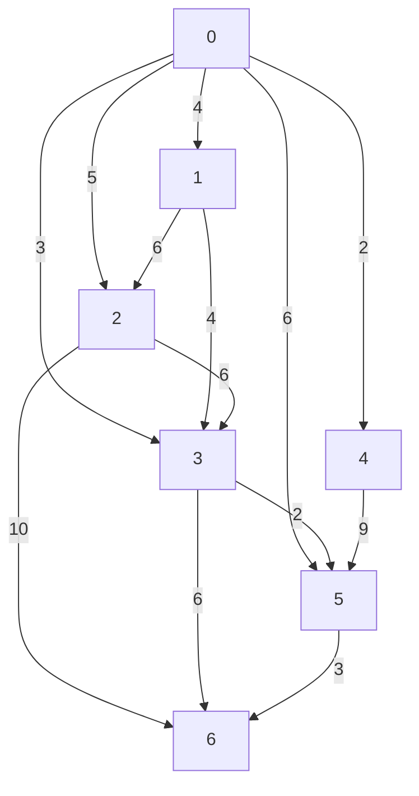

# Java アルゴリズム演習

<table><tr><td>No</td><td>課題 ID</td><td>課題名</td></tr><tr><td>01</td><td>0110</td><td>文字列の2値比較</td></tr><tr><td>02</td><td>0111</td><td>文字列の検索1</td></tr><tr><td>03</td><td>0112</td><td>文字列の検索2</td></tr><tr><td>04</td><td>0113</td><td>文字列の置換</td></tr><tr><td>05</td><td>0114</td><td>文字列の分解1</td></tr><tr><td>06</td><td>0115</td><td>文字列の結合</td></tr><tr><td>07</td><td>0116</td><td>偶数奇数の判定</td></tr><tr><td>08</td><td>0117</td><td>点数による進級の判定</td></tr><tr><td>09</td><td>0130</td><td>3値の最大値、中央値、平均値を求める</td></tr><tr><td>10</td><td>0140</td><td>複数分岐(switch 文)</td></tr><tr><td>11</td><td>0160</td><td>デシジョンテーブル</td></tr><tr><td>12</td><td>0200</td><td>1からnまでの整数の和を求める</td></tr><tr><td>13</td><td>0210</td><td>九九表の作成</td></tr><tr><td>14</td><td>0215</td><td>足して10になる2つの数値を調べる</td></tr><tr><td>15</td><td>0235</td><td>10進数からn進数への変換</td></tr><tr><td>16</td><td>0240</td><td>2次元配列の要素探索</td></tr><tr><td>17</td><td>0241</td><td>直角三角形の作成</td></tr><tr><td>18</td><td>0242</td><td>二等辺三角形の作成</td></tr><tr><td>19</td><td>0245</td><td>最大公約数を求める</td></tr><tr><td>20</td><td>0250</td><td>配列要素から値を検索する(二分探索)</td></tr><tr><td>21</td><td>0255</td><td>カレンダーの作成</td></tr><tr><td>22</td><td>0256</td><td>日付の妥当性</td></tr><tr><td>23</td><td>0257</td><td>日付の計算</td></tr><tr><td>24</td><td>0320</td><td>階乗(n!)の計算(再帰呼び出し)</td></tr><tr><td>25</td><td>0350</td><td>グラフから最短経路を求める(ダイクストラ法)</td></tr><tr><td>26</td><td>0360</td><td>オセロ盤</td></tr><tr><td>27</td><td>0370</td><td>数当てゲーム(当たり判定)</td></tr></table>

# 課題 0110

# 問題

キーボードから2つの文字列を入力し、辞書順で小さい方から値を出力する。

同じ値の場合は、「2つの文字列は同じです」と出力する。

# 実行例

>Java Ex0110

文字列1：

ABCE

文字列2：

ABCD

ABCD ABCE

>Java Ex0110

文字列1：

ABCD

文字列2：

ABCD

2つの文字列は同じです ->ABCD

作成クラス名

Ex0110.java

# 課題 0111

# 問題

キーボードから文字列を入力し、文字列内に「①,③,⑤,⑦,⑨」が含まれるか判定する。

含まれる場合は「許可しない文字(文字：XX YY桁目)が含まれます」、

含まれない場合は「許可する文字列です」と出力する。

# 実行例

>Java Ex0111

文字列：

この文字列（1）は許可されますか。

許可する文字列です

>Java Ex0111

文字列：

この文字列①は許可されますか。

許可しない文字(文字：① 6 桁目)が含まれます

作成クラス名

Ex0111.java

# 課題 0112

# 問題

キーボードから文字列を入力し、文字列内に半角カナが含まれるか判定する。

含まれる場合は「半角カナが含まれます」、含まれない場合は「許可する文字列です」と出力する。

# 実行例

```txt
>Java Ex0112 
```

文字列：

この文字リンゴは許可されますか。

許可する文字列です

```txt
>Java Ex0112 
```

文字列：

この文字リンゴは許可されますか。

半角カナが含まれます

作成クラス名

Ex0112.java

# 課題 0113

# 問題

キーボードから文字列を入力し、文字列内に全角数字が含まれる場合は半角数字に置換して出力する。

# 実行例

```txt
>Java Ex0113 
```

文字列：

昨日の円相場は120.50でした。

結果：昨日の円相場は 120.50 でした。

```txt
>Java Ex0113 
```

文字列：

昨日の円相場は 120.50 でした。

結果：昨日の円相場は120.50でした。

作成クラス名

Ex0113.java

# 課題 0114

# 問題

キーボードから文字列を入力し、文字列内の半角空白で単語に分解する。

分解後、単語を逆順で出力する。半角空白が連続で入力された場合は無視する。

# 実行例

>Java Ex0114

文字列：

one two three

結果：three two one

>Java Ex0114

文字列：

one two three four

結果：four three two one

作成クラス名

Ex0114.java

# 課題 0115

# 問題

キーボードから文字列を入力し、文字列内の半角空白で単語に分解する。

分解後、単語の出力順序が偶数と奇数でそれぞれ結合して出力する。

# 実行例

>Java Ex0115

文字列：

数学 80 英語 100 理科 75 国語 0 歴史 60

奇数番目：数学 英語 理科 国語 歴史

偶数番目：80 100 75 0 60

作成クラス名

Ex0115.java

# 課題 0116

# 問題

2つの整数値 i1、i2 を入力する。

i1 が偶数であり、かつ i2 が偶数の場合、「2 つの値ともに偶数です」と表示する。

i1 が奇数であり、かつ i2 が偶数の場合、「i1 は奇数です。i2 は偶数です」と表示する。

i1 が偶数であり、かつ i2 が奇数の場合、「i1 は偶数です。i2 は奇数です」と表示する。

i1 が奇数であり、かつ i2 が奇数の場合、「2 つの値ともに奇数です」と表示する。

# 実行例

```txt
>Java Ex0116
input number1 :
3
input number2 :
6
i1 は奇数です。i2 は偶数です
>Java Ex0116
input number1 :
6
input number2 :
12
2 つの値ともに偶数です
```

作成クラス名

Ex0116.java

# 課題 0117

# 問題

英語の試験の点数 e\_score、数学の試験の点数 m\_score を入力する。

両方の点数が 80 点以上の場合、「進級」と表示する。

点数のどちらかが 80 点を下回る場合、「再試験」と表示する。

両方の点数とも80点を下回る場合、「留年」と表示する。

# 実行例

```txt
>Java Ex0117
input english score :
90
input math score :
85

進級

>Java Ex0117
input english score :
100
input math score :
76

再試験 
```

作成クラス名

Ex0117.java

# 課題 0130

# 問題

キーボードから3つの整数値を入力し、最大値、中央値、平均値(小数第3位を四捨五入)を出力する。

# 実行例

```txt
>Java Ex0130
input number1 :
40
input number2 :
20
input number3 :
30
最大值 = 40 中央值 = 30 平均值=30
```

作成クラス名

Ex0130.java

# 課題 0140

# 問題

キーボードから2つの整数値とコマンドを入力し、計算結果を出力する。

コマンドの意味は以下の通りとする。

0: 足し算

1: 引き算

2: 掛け算

その他：割り算

# 実行例

```yaml
>Java Ex0140
input number1 :
200
input number2 :
50
input command :
0 
```

計算結果 = 250

```yaml
>Java Ex0140
input number1 :
200
input number2 :
60
input command :
8 
```

計算結果 = 3

作成クラス名

Ex0140.java

# 課題 0160

# 問題

キーボードから入力された 0\~5 の範囲の 2 つの数字を元に、占いの結果を出力する。

占いの結果は以下のルールに従う。

<table><tr><td rowspan="2" colspan="2"></td><td colspan="6">2つ目の数字</td></tr><tr><td>0</td><td>1</td><td>2</td><td>3</td><td>4</td><td>5</td></tr><tr><td rowspan="6">1つ目の数字</td><td>0</td><td>吉</td><td>吉</td><td>凶</td><td>凶</td><td>凶</td><td>吉</td></tr><tr><td>1</td><td>吉</td><td>吉</td><td>凶</td><td>吉</td><td>凶</td><td>吉</td></tr><tr><td>2</td><td>凶</td><td>凶</td><td>吉</td><td>吉</td><td>吉</td><td>吉</td></tr><tr><td>3</td><td>凶</td><td>吉</td><td>吉</td><td>吉</td><td>凶</td><td>凶</td></tr><tr><td>4</td><td>凶</td><td>凶</td><td>凶</td><td>吉</td><td>吉</td><td>凶</td></tr><tr><td>5</td><td>凶</td><td>吉</td><td>吉</td><td>凶</td><td>凶</td><td>凶</td></tr></table>

# 実行例

<table><tr><td>&gt;Java Ex0160</td></tr><tr><td>1つ目の数字(0~5):</td></tr><tr><td>2</td></tr><tr><td>2つ目の数字(0~5):</td></tr><tr><td>4</td></tr><tr><td>占いの結果は吉です</td></tr><tr><td>&gt;Java Ex0160</td></tr><tr><td>1つ目の数字(0~5):</td></tr><tr><td>5</td></tr><tr><td>2つ目の数字(0~5):</td></tr><tr><td>5</td></tr><tr><td>占いの結果は凶です</td></tr></table>

作成クラス名

Ex0160.java

# 課題 0200

# 問題

キーボードから1つの整数値nを入力し、1からnまでの和を求め、結果を出力する。

# 実行例

```yaml
>Java Ex0200
input number :
5 
```

合計値 = 15

```txt
>Java Ex0200
input number :
10 
```

合計値 = 55

作成クラス名

Ex0200.java

# 課題 0210

# 問題

下記実行例のように、九九の表を出力する。

実行例

<table><tr><td colspan="9">&gt;Java Ex0210</td></tr><tr><td>01</td><td>02</td><td>03</td><td>04</td><td>05</td><td>06</td><td>07</td><td>08</td><td>09</td></tr><tr><td>02</td><td>04</td><td>06</td><td>08</td><td>10</td><td>12</td><td>14</td><td>16</td><td>18</td></tr><tr><td>03</td><td>06</td><td>09</td><td>12</td><td>15</td><td>18</td><td>21</td><td>24</td><td>27</td></tr><tr><td>04</td><td>08</td><td>12</td><td>16</td><td>20</td><td>24</td><td>28</td><td>32</td><td>36</td></tr><tr><td>05</td><td>10</td><td>15</td><td>20</td><td>25</td><td>30</td><td>35</td><td>40</td><td>45</td></tr><tr><td>06</td><td>12</td><td>18</td><td>24</td><td>30</td><td>36</td><td>42</td><td>48</td><td>54</td></tr><tr><td>07</td><td>14</td><td>21</td><td>28</td><td>35</td><td>42</td><td>49</td><td>56</td><td>63</td></tr><tr><td>08</td><td>16</td><td>24</td><td>32</td><td>40</td><td>48</td><td>56</td><td>64</td><td>72</td></tr><tr><td>09</td><td>18</td><td>27</td><td>36</td><td>45</td><td>54</td><td>63</td><td>72</td><td>81</td></tr></table>

作成クラス名

Ex0210.java

# 課題 0215

# 問題

キーボードから複数の数字を入力し、足して10になる2つの数値をペアとして出力する。

# 実行例

```txt
>Java Ex0215
input number :
1 3 5 7

3 と 7 は足して 10 となるペアです

>Java Ex0215
input number :
5 6

ペアとなる数字はありません

>Java Ex0215
input number :
1 2 3 4 5 6 7 8 9

1 と 9、2 と 8、3 と 7、4 と 6
```

作成クラス名

Ex0215.java

# 課題 0235

# 問題

キーボードから入力された0～255の範囲の10進数整数値を2進数と16進数に変換して出力する。

# 実行例

```txt
>Java Ex0235
0～255 の範囲の 10 進数：
255

2 進数の変換結果：11111111
16 進数の変換結果：FF

>Java Ex0235
0～255 の範囲の 10 進数：
16

2 進数の変換結果：00010000
16 進数の変換結果：10
```

作成クラス名

Ex0235.java

# 課題 0240

# 問題

2 桁の数字を入力すると、九九の表に値があるかどうか出力する。

# 実行例

```txt
>Java Ex0240
input number :
64
九九の表（8 * 8）にあります
>Java Ex0240
input number :
65
九九の表にありません
```

作成クラス名

Ex0240.java

# 課題 0241

# 問題

整数値を入力し、その行数分の実行例のように直角三角形を出力する。

実行例  
```txt
>Java Ex0241
input number :
5
*
** *
*** *
**** *
***** *
>Java Ex0241
input number :
3
*
** *
*** 
```

作成クラス名

Ex0241.java

# 課題 0242

# 問題

整数値を入力し、その行数分の実行例のように二等辺三角形を出力する。

実行例  
```txt
>Java Ex0242
input number :
5
*
* * *
* * * *
* * * * *
* * * * * *
* * * * * * *
>Java Ex0242
input number :
3
*
* * *
* * *
* * * * * 
```

作成クラス名

Ex0242.java

# 課題 0245

# 問題

キーボードから2つの整数値を入力し、最大公約数を出力する。

実行例  
```txt
>Java Ex0245
input number1 :
252
input number2 :
105
最大公約数 = 21
>Java Ex0245
input number1 :
1368
input number2 :
456
最大公約数 = 456
```

作成クラス名

Ex0245.java

# 課題 0250

# 問題

キーボードから2桁の数値を入力し、その数値が100以下の素数か判断し出力する。

数値が素数か否かの判断は、100以下の素数を要素に持つ配列の中から二分探索を使用して行う。

# 実行例

>Java Ex0250

input number :

34

素数ではありません

>Java Ex0250

input number :

17

素数です

作成クラス名

Ex0250.java

# 課題 0255

# 問題

キーボードから「月の始まりの曜日の番号」と「月末の日の数字」を入力し、カレンダーを出力する。

「月の始まりの曜日の番号」は以下の通りとする。

日曜：0 月曜：1 火曜：2 水曜：3 木曜：4 金曜：5 土曜：6

# 実行例

>Java Ex0255

月の始まりの曜日を数字で入力してください：

6

月末の日を数字で入力してください：

31

日月火水木金土

01

02 03 04 05 06 07 08

09 10 11 12 13 14 15

16 17 18 19 20 21 22

23 24 25 26 27 28 29

30 31

作成クラス名

Ex0255.java

# 課題 0256

# 問題

キーボードから文字列を入力し、その文字列が指定した日付形式か否か出力する。

日付形式は「YYYY/MM/DD」とする。

# 実行例

>Java Ex0256

input date :

2018/06/13

指定した形式です

>Java Ex0256

input date :

2018/6/3

指定した形式ではありません

作成クラス名

Ex0256.java

# 課題 0257

# 問題

キーボードから日付を2つ入力し、大きい日付から小さい日付の差を秒で出力する。

日付形式は「YYYY/MM/DD」とする。日付が等しい場合はゼロを出力する。

# 実行例

>Java Ex0257

input date1 :

2018/06/13

input date2 :

2018/06/11

日数の差は2日で86400秒です

>Java Ex0257

input date1 :

2018/06/11

input date2 :

2018/06/13

日数の差は2日で86400秒です

>Java Ex0256

input date1 :

2018/06/13

input date2 :

2018/06/13

日数の差は0日です

作成クラス名

Ex0257.java

# 課題 0320

# 問題

キーボードから入力した整数値nの階乗を計算して出力する。

繰り返し文でもプログラムは作成できるが、今回は再帰呼び出しで作成すること。

# 実行例

```txt
>Java Ex0320
input number :
10
10 の階乗は 3628800 です
```

作成クラス名

Ex0320.java

# 課題 0350

# 問題

下図のように、円で表したノードとノード間の線で表したエッジがある。ノードは7つあり、0～6の番号が振られている。また、隣接するノード間の距離は図のように決まっている。

このとき、ノード0からノード6までの最短経路の長さを求めよ。


<details>
<summary>flowchart</summary>


</details>

# 実行例

>Java Ex0350

頂点 0 確定。距離=0

頂点 4 確定。 距離=2

頂点 3 確定。距離=8

頂点 5 確定。 距離=10

頂点 6 確定。 距離=13

作成クラス名

Ex0350.java

# 課題 0360

# 問題

オセロ盤を初期表示する。黒白交互に打つ場所を入力し、打った後の盤面を表示することを繰り返す。最後まで打ち終えたら終了する。

但し、打てる場所がなくパスする場合は位置として「9」を入力する。

# 実行例

<table><tr><td>&gt;Java Ex0360</td></tr><tr><td>1 2 3 4 5 6 7 8</td></tr><tr><td>1 □□□□□□□□</td></tr><tr><td>2 □□□□□□□□</td></tr><tr><td>3 □□□□□□□□</td></tr><tr><td>4 □□□●○□□□</td></tr><tr><td>5 □□□○●□□□</td></tr><tr><td>6 □□□□□□□□</td></tr><tr><td>7 □□□□□□□□</td></tr><tr><td>8 □□□□□□□□</td></tr><tr><td>●:2 ○:2</td></tr><tr><td>黒の手(行、列) &gt;4,6</td></tr><tr><td>1 2 3 4 5 6 7 8</td></tr><tr><td>1 □□□□□□□□</td></tr><tr><td>2 □□□□□□□□</td></tr><tr><td>3 □□□□□□□□</td></tr><tr><td>4 □□□●●●□□</td></tr><tr><td>5 □□□○●□□□</td></tr><tr><td>6 □□□□□□□□</td></tr><tr><td>7 □□□□□□□□</td></tr><tr><td>8 □□□□□□□□</td></tr><tr><td>●:4 ○:1</td></tr><tr><td>白の手(行、列) &gt;</td></tr></table>

作成クラス名

Ex0360.java

# 課題 0370

# 問題

起動時引数として正解の4桁の数字を与える。

999 を入力してギブアップするか、正解を入力するまで予想数字の入力と当たり判定の結果を出力し続ける。

ヒット：位置も数字も一致している数

ブロー：位置は一致していないが、数字が一致している数

# 実行例

```txt
>Java Ex0370 0324 
```

(1 回目) 予測数字を入力してください: 0541

```txt
ヒット:1 ブロー:1
```

(2 回目) 予測数字を入力してください : 0514

```txt
ヒット:2 ブロー:0
```

(3 回目) 予測数字を入力してください: 999

```txt
正解は 0324 でした。
```

作成クラス名

Ex0370.java
